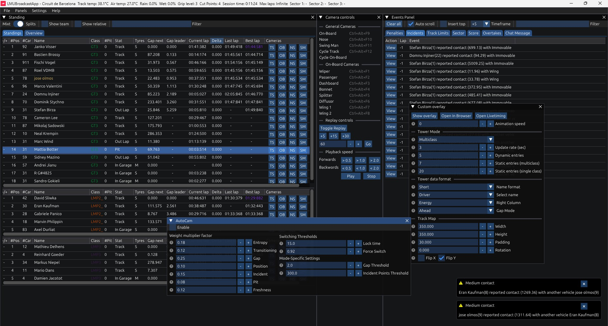
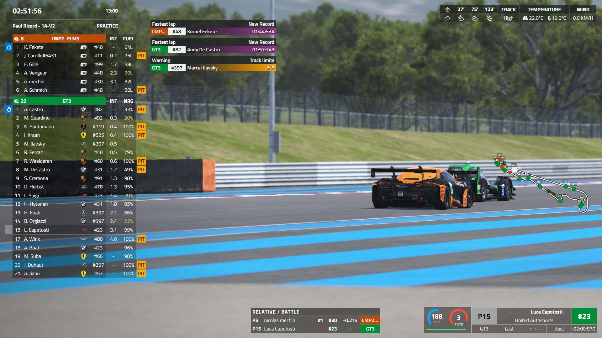
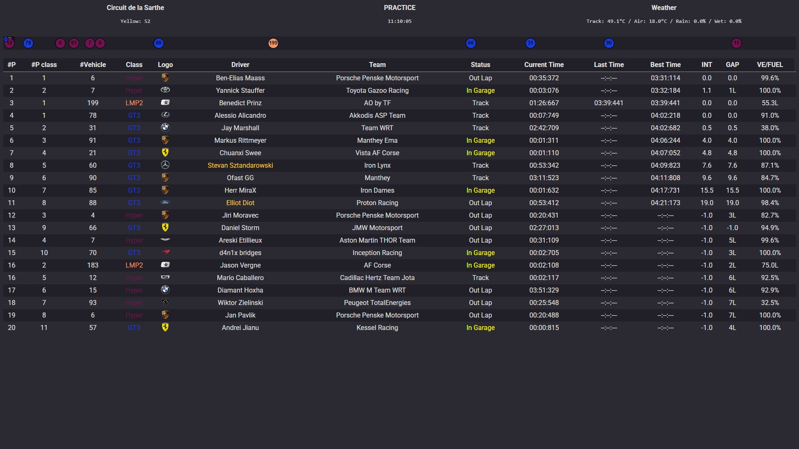
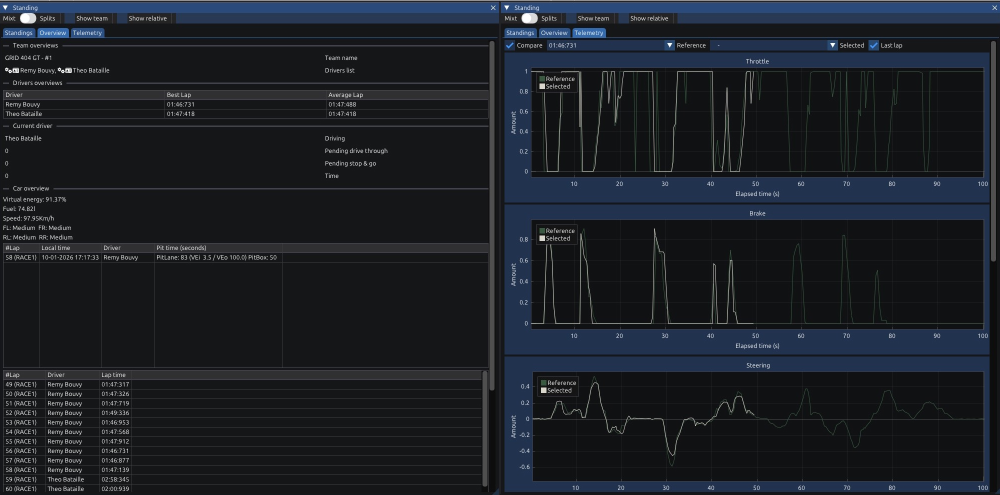

### 🚀 LMUBroadcastApp

    
    "LMU Broadcast App" is an intuitive broadcast application that allows a small production team (or even a single operator) to manage a live stream and replays, view track event, handle cameras, etc. enhancing the storytelling of the race.

    

---

### 🎬 Overview
The program offers a simple way to switch between cameras and access the various events that can occur during the race: penalties, incidents, track limits, etc.
Below is a description of the different panels within the game:

- 📊 **Standings**: As the name indicates, here you can see the participants in the race. This table contains the on-track position, car number, driver name, the different cameras, etc.
- 🎨 **Overlays**: Custom overlay (session info, standings tower, weather forecast, trackmap and driver info).
- 🎮 **Game Panels**: These are the different overlays in the game. Enable "In-game overlay" to see them.
- 🎥 **Auto Cam**: Let the system set the viewed vehicle on track based on the action on track.
- 🎥 **Events Panel**: Events that have occurred during the race.
- ⚠️ **Log Panel**: Built-in logging system for debugging and monitoring.

---

### 📥 Download
👉 Download the latest version: 
https://github.com/LmuBroadcastApp/LMUBroadcastApp/releases/latest/download/LMUBroadcastApp.zip

📦 All releases: 
https://github.com/LmuBroadcastApp/LMUBroadcastApp/releases

---

### ⚙️ Installation
1. Download the latest release from the link above
2. Extract the archive
3. Run the executable file
4. Launch the app after the game session is fully loaded

---

### 🛠️ Issues & Contributions
Have a bug report, feature request, or idea?  
👉 Open an issue: https://github.com/LmuBroadcastApp/LMUBroadcastApp/issues

---

### 📚 Wiki
* 📨 [Notifications](wiki/notifications.md)
* 🔣 [Keybindings](wiki/bindings.md)
* 🎦 [AutoCam](wiki/autocam.md)

---

### 🖼️ Screenshots
<table>
    <tr>
        <td></td>
        <td></td>
    </tr>
    <tr>
        <td colspan="2"></td>
    </tr>
</table>

---

### 📝 Changelog
See [CHANGELOG.md](CHANGELOG.md) for a list of changes and updates.

---

## Disclaimer
Due to inconsistencies in the game's REST API, the application may sometimes exhibit undesirable behavior (especially when loading a session). It is best to open the application when the session is loaded.
In addition, the API (REST, WebSockets, shared memory) behaves differently depending on the type of game session (daily, endurance, hosted, weekend, etc).

## Notice
The application is free to use. Some features are available at no cost, while others require a paid subscription. 
**The annual subscription costs €30**.

**Free features**:
 - Standings
 - Camera control

**Premium features (behind a paywall)**:
 - Events (incidents, track limits, etc.)
 - Vehicle overview and telemetry
 - Replay and replay controls
 - Autocam
 - Overlay
